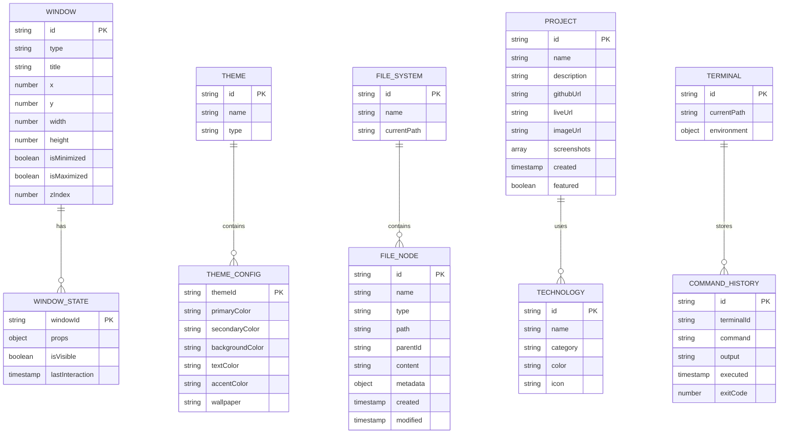

# Documento de Arquitectura Técnica - Portafolio Linux

## 1. Diseño de Arquitectura

```mermaid
graph TD
    A[Usuario Browser] --> B[React Frontend Application]
    B --> C[Context Providers]
    C --> D[Component System]
    C --> E[Custom Hooks]
    C --> F[Utils & Services]
    
    subgraph "Frontend Layer"
        B
        C
        D
        E
        F
    end
    
    subgraph "State Management"
        G[Theme Context]
        H[Window Manager Context]
        I[File System Context]
        J[Terminal Context]
    end
    
    subgraph "Local Storage"
        K[localStorage - Themes & Settings]
        L[sessionStorage - Window States]
    end
    
    C --> G
    C --> H
    C --> I
    C --> J
    
    F --> K
    F --> L
    
    subgraph "External Services (Optional)"
        M[EmailJS - Contact Form]
        N[GitHub API - Projects]
    end
    
    F --> M
    F --> N
end
```

## 2. Descripción de Tecnologías

* Frontend: React@18 + JavaScript ES6+ + Tailwind CSS + Framer Motion

* Build Tool: Vite

* State Management: React Context API + useReducer

* Styling: Tailwind CSS + CSS Modules para componentes específicos

* Animations: Framer Motion + CSS Transitions

* Icons: React Icons + Lucide React

* Fonts: Google Fonts (Ubuntu, Fira Code)

* Storage: localStorage + sessionStorage para persistencia

* Deployment: Vercel/Netlify

## 3. Definiciones de Rutas

| Ruta      | Propósito                                                      |
| --------- | -------------------------------------------------------------- |
| /         | Página principal - Escritorio Linux con todas las aplicaciones |
| /desktop  | Alias para la página principal                                 |
| /terminal | Vista enfocada en terminal (para enlaces directos)             |
| /projects | Vista enfocada en explorador de proyectos                      |
| /about    | Vista enfocada en información personal                         |
| /contact  | Vista enfocada en formulario de contacto                       |

## 4. Almacenamiento Local y APIs Externas

### 4.1 Almacenamiento Local

**localStorage - Configuraciones Persistentes**

```javascript
// Guardar configuración de tema
localStorage.setItem('portfolio-theme', JSON.stringify({
  id: 'ubuntu-dark',
  type: 'dark',
  customizations: {}
}));

// Guardar configuraciones del sistema
localStorage.setItem('portfolio-settings', JSON.stringify({
  wallpaper: 'ubuntu-default.jpg',
  fontSize: 14,
  animations: true
}));

// Guardar proyectos y contenido
localStorage.setItem('portfolio-projects', JSON.stringify(projectsData));
```

**sessionStorage - Estados Temporales**

```javascript
// Guardar estado de ventanas
sessionStorage.setItem('window-states', JSON.stringify({
  openWindows: ['terminal-1', 'explorer-1'],
  positions: {
    'terminal-1': { x: 100, y: 50, width: 800, height: 400 }
  }
}));

// Guardar historial de terminal
sessionStorage.setItem('terminal-history', JSON.stringify(commandHistory));
```

### 4.2 APIs Externas (Servicios Opcionales)

**EmailJS - Servicio de Contacto**

**Envío de mensaje de contacto**

```
POST https://api.emailjs.com/api/v1.0/email/send
```

Request:

| Nombre Parámetro | Tipo Parámetro | Requerido | Descripción                 |
| ---------------- | -------------- | --------- | --------------------------- |
| service\_id      | string         | true      | ID del servicio EmailJS     |
| template\_id     | string         | true      | ID de la plantilla de email |
| user\_id         | string         | true      | ID público de EmailJS       |
| template\_params | object         | true      | Parámetros del formulario   |

Response:

| Nombre Parámetro | Tipo Parámetro | Descripción           |
| ---------------- | -------------- | --------------------- |
| status           | number         | Código de estado HTTP |
| text             | string         | Mensaje de respuesta  |

Ejemplo:

```json
{
  "service_id": "service_portfolio",
  "template_id": "template_contact",
  "user_id": "user_public_key",
  "template_params": {
    "from_name": "Juan Pérez",
    "from_email": "juan@example.com",
    "message": "Interesado en sus servicios de desarrollo web",
    "subject": "Consulta desde portafolio"
  }
}
```

**GitHub API - Información de Proyectos**

**Obtener repositorios del usuario**

```
GET https://api.github.com/users/martin-godinez/repos
```

Request:

| Nombre Parámetro | Tipo Parámetro | Requerido | Descripción                                         |
| ---------------- | -------------- | --------- | --------------------------------------------------- |
| sort             | string         | false     | Criterio de ordenamiento (updated, created, pushed) |
| direction        | string         | false     | Dirección del ordenamiento (asc, desc)              |
| per\_page        | number         | false     | Número de resultados por página (máximo 100)        |

Response:

| Nombre Parámetro  | Tipo Parámetro | Descripción                   |
| ----------------- | -------------- | ----------------------------- |
| name              | string         | Nombre del repositorio        |
| description       | string         | Descripción del proyecto      |
| html\_url         | string         | URL del repositorio           |
| language          | string         | Lenguaje principal            |
| stargazers\_count | number         | Número de estrellas           |
| updated\_at       | string         | Fecha de última actualización |

## 5. Arquitectura de Componentes

```mermaid
graph TD
    A[App.tsx] --> B[ThemeProvider]
    B --> C[WindowManagerProvider]
    C --> D[FileSystemProvider]
    D --> E[TerminalProvider]
    E --> F[Desktop]
    
    F --> G[Taskbar]
    F --> H[DesktopIcons]
    F --> I[WindowManager]
    F --> J[ContextMenu]
    
    G --> K[StartMenu]
    G --> L[SystemTray]
    G --> M[Clock]
    
    I --> N[TerminalWindow]
    I --> O[FileExplorerWindow]
    I --> P[ApplicationCenterWindow]
    I --> Q[SettingsWindow]
    I --> R[AboutWindow]
    
    N --> S[TerminalEmulator]
    N --> T[CommandProcessor]
    N --> U[FileSystemNavigator]
    
    O --> V[FileTree]
    O --> W[FileViewer]
    O --> X[FilePreview]
    
    P --> Y[ProjectGallery]
    P --> Z[ProjectCard]
    P --> AA[TechnologyBadge]
    
    Q --> BB[ThemeSelector]
    Q --> CC[WallpaperSelector]
    Q --> DD[FontSelector]
    
    R --> EE[ProfileSection]
    R --> FF[SkillsSection]
    R --> GG[ContactForm]
end
```

## 6. Modelo de Datos

### 6.1 Definición del Modelo de Datos



### 6.2 Definición de Estructuras de Datos (JavaScript)

**Estructura de Ventanas**

```javascript
// Estructura para ventanas del sistema
const windowStructure = {
  id: '', // string
  type: '', // 'terminal' | 'explorer' | 'applications' | 'settings' | 'about'
  title: '', // string
  position: { x: 0, y: 0 }, // { x: number, y: number }
  size: { width: 0, height: 0 }, // { width: number, height: number }
  state: '', // 'normal' | 'minimized' | 'maximized'
  zIndex: 0, // number
  isResizable: true, // boolean
  isDraggable: true, // boolean
  props: {} // object
};

// Estado del gestor de ventanas
const windowManagerState = {
  windows: [], // Array de ventanas
  activeWindowId: null, // string | null
  nextZIndex: 100 // number
};
```

**Estructura de Temas**

```javascript
// Configuración de tema
const themeConfig = {
  id: '', // string
  name: '', // string
  type: '', // 'light' | 'dark'
  colors: {
    primary: '', // string
    secondary: '', // string
    background: '', // string
    surface: '', // string
    text: '', // string
    textSecondary: '', // string
    accent: '', // string
    border: '', // string
    shadow: '' // string
  },
  wallpaper: '', // string
  fonts: {
    system: '', // string
    monospace: '' // string
  }
};

// Estado del tema
const themeState = {
  currentTheme: {}, // ThemeConfig
  availableThemes: [], // Array de ThemeConfig
  customizations: {} // Partial ThemeConfig
}
```

**Estructura del Sistema de Archivos**

```javascript
// Nodo del sistema de archivos
const fileNode = {
  id: '', // string
  name: '', // string
  type: '', // 'file' | 'directory'
  path: '', // string
  parentId: null, // string | null
  children: [], // Array de FileNode (opcional)
  content: '', // string (opcional)
  metadata: {
    size: 0, // number
    created: new Date(), // Date
    modified: new Date(), // Date
    permissions: '', // string
    mimeType: '' // string (opcional)
  }
};

// Estado del sistema de archivos
const fileSystemState = {
  currentPath: '', // string
  fileTree: {}, // FileNode
  selectedFiles: [], // Array de strings
  clipBoard: {
    operation: null, // 'copy' | 'cut' | null
    files: [] // Array de strings
  }
}
```

**Estructura de Proyectos**

```javascript
// Proyecto individual
const project = {
  id: '', // string
  name: '', // string
  description: '', // string
  longDescription: '', // string (opcional)
  technologies: [], // Array de Technology
  githubUrl: '', // string (opcional)
  liveUrl: '', // string (opcional)
  imageUrl: '', // string
  screenshots: [], // Array de strings
  category: '', // 'web' | 'security' | 'server' | 'mobile' | 'desktop'
  status: '', // 'completed' | 'in-progress' | 'planned'
  featured: false, // boolean
  created: new Date(), // Date
  updated: new Date() // Date
};

// Tecnología utilizada
const technology = {
  id: '', // string
  name: '', // string
  category: '', // 'frontend' | 'backend' | 'database' | 'devops' | 'security'
  color: '', // string
  icon: '', // string
  proficiency: 1 // 1 | 2 | 3 | 4 | 5
}
```

**Estructura de Terminal**

```javascript
// Comando de terminal
const terminalCommand = {
  id: '', // string
  command: '', // string
  args: [], // Array de strings
  output: '', // string
  exitCode: 0, // number
  timestamp: new Date(), // Date
  duration: 0 // number
};

// Estado de la terminal
const terminalState = {
  currentPath: '', // string
  history: [], // Array de TerminalCommand
  environment: {}, // Object con variables de entorno
  isProcessing: false, // boolean
  prompt: '' // string
};

// Comando personalizado
const customCommand = {
  name: '', // string
  description: '', // string
  usage: '', // string
  handler: async (args, context) => { // function
    // Lógica del comando
    return 'output';
  }
}
```

**Inicialización de Datos**

```javascript
// Datos iniciales del sistema de archivos
const initialFileSystem = {
  id: 'root',
  name: '/',
  type: 'directory',
  path: '/',
  parentId: null,
  metadata: {
    size: 0,
    created: new Date(),
    modified: new Date(),
    permissions: 'drwxr-xr-x'
  },
  children: [
    {
      id: 'home',
      name: 'home',
      type: 'directory',
      path: '/home',
      parentId: 'root',
      metadata: { size: 0, created: new Date(), modified: new Date(), permissions: 'drwxr-xr-x' },
      children: [
        {
          id: 'martin',
          name: 'martin',
          type: 'directory',
          path: '/home/martin',
          parentId: 'home',
          metadata: { size: 0, created: new Date(), modified: new Date(), permissions: 'drwxr-xr-x' },
          children: [
            {
              id: 'about',
              name: 'about.txt',
              type: 'file',
              path: '/home/martin/about.txt',
              parentId: 'martin',
              content: 'Martin Gabriel Godinez Morales\nDesarrollador Full Stack especializado en desarrollo web y ciberseguridad\nExperiencia en React, Node.js, Python, Linux y administración de servidores',
              metadata: { size: 256, created: new Date(), modified: new Date(), permissions: '-rw-r--r--', mimeType: 'text/plain' }
            },
            {
              id: 'projects',
              name: 'projects',
              type: 'directory',
              path: '/home/martin/projects',
              parentId: 'martin',
              metadata: { size: 0, created: new Date(), modified: new Date(), permissions: 'drwxr-xr-x' },
              children: []
            },
            {
              id: 'documents',
              name: 'documents',
              type: 'directory',
              path: '/home/martin/documents',
              parentId: 'martin',
              metadata: { size: 0, created: new Date(), modified: new Date(), permissions: 'drwxr-xr-x' },
              children: []
            }
          ]
        }
      ]
    }
  ]
};

// Comandos personalizados de la terminal
const customCommands = [
  {
    name: 'about',
    description: 'Muestra información personal del desarrollador',
    usage: 'about',
    handler: async () => 'Martin Gabriel Godinez Morales - Desarrollador Full Stack'
  },
  {
    name: 'skills',
    description: 'Lista las habilidades técnicas',
    usage: 'skills [categoria]',
    handler: async (args) => {
      const skills = {
        frontend: ['React', 'TypeScript', 'Tailwind CSS', 'Next.js'],
        backend: ['Node.js', 'Python', 'Express', 'FastAPI'],
        database: ['PostgreSQL', 'MongoDB', 'Redis'],
        security: ['Penetration Testing', 'OWASP', 'Nmap', 'Burp Suite'],
        devops: ['Docker', 'Linux', 'Nginx', 'CI/CD']
      };
      const category = args[0];
      if (category && skills[category]) {
        return `${category.toUpperCase()}: ${skills[category].join(', ')}`;
      }
      return Object.entries(skills)
        .map(([cat, techs]) => `${cat.toUpperCase()}: ${techs.join(', ')}`)
        .join('\n');
    }
  },
  {
    name: 'projects',
    description: 'Lista los proyectos disponibles',
    usage: 'projects [filtro]',
    handler: async (args) => {
      return 'Proyectos disponibles:\n- E-commerce Platform (React + Node.js)\n- Security Scanner (Python)\n- Server Monitor (Bash + Python)';
    }
  },
  {
    name: 'contact',
    description: 'Muestra información de contacto',
    usage: 'contact',
    handler: async () => {
      return 'Contacto:\nEmail: gmoficial16@gmail.com\nLinkedIn: /in/martin-godinez\nGitHub: /martin-godinez';
    }
  }
];
```

