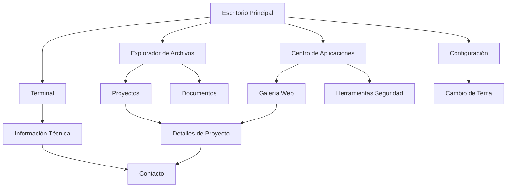

# Documento de Requerimientos del Producto - Portafolio Linux

## 1. Descripción General del Producto

Portafolio interactivo profesional que simula una interfaz de escritorio Linux (Ubuntu/Debian) para mostrar las habilidades y proyectos de Martin Gabriel Godinez Morales, desarrollador especializado en desarrollo web, ciberseguridad y administración de servidores. El portafolio debe transmitir profesionalismo técnico y experiencia en entornos Linux.

## 2. Características Principales

### 2.1 Roles de Usuario

| Rol                | Método de Acceso   | Permisos Principales                                                          |
| ------------------ | ------------------ | ----------------------------------------------------------------------------- |
| Visitante          | Acceso directo web | Navegar por todas las secciones, interactuar con terminal, explorar proyectos |
| Reclutador/Cliente | Acceso directo web | Acceso completo a información profesional, descargar CV, contacto directo     |

### 2.2 Módulos de Funcionalidad

Nuestro portafolio Linux consta de las siguientes páginas principales:

1. **Escritorio Principal**: barra de tareas inferior, menú de aplicaciones, iconos de aplicaciones, reloj del sistema, indicadores de estado
2. **Terminal Interactiva**: comandos personalizados, navegación de archivos, información profesional, simulación de entorno Linux real
3. **Explorador de Archivos**: estructura de carpetas con proyectos, documentos técnicos, certificaciones, código fuente
4. **Centro de Aplicaciones**: galería de proyectos web, herramientas de ciberseguridad, scripts de servidor
5. **Configuración del Sistema**: cambio de temas (oscuro/claro), personalización de interfaz, información del sistema
6. **Ventana Acerca de**: información personal, habilidades técnicas, experiencia profesional

### 2.3 Detalles de Páginas

| Nombre de Página       | Nombre del Módulo         | Descripción de Funcionalidad                                                                       |
| ---------------------- | ------------------------- | -------------------------------------------------------------------------------------------------- |
| Escritorio Principal   | Barra de Tareas           | Mostrar aplicaciones abiertas, menú de inicio, reloj sistema, indicadores de red/batería simulados |
| Escritorio Principal   | Fondo de Pantalla         | Imagen de Ubuntu/Debian personalizada, cambio dinámico según tema                                  |
| Escritorio Principal   | Iconos de Escritorio      | Accesos directos a Terminal, Explorador, Proyectos, Configuración                                  |
| Terminal Interactiva   | Emulador de Terminal      | Comandos Linux reales (ls, cd, cat, grep), navegación de sistema de archivos simulado              |
| Terminal Interactiva   | Sistema de Archivos       | Estructura de carpetas con información profesional, proyectos, documentos                          |
| Terminal Interactiva   | Historial de Comandos     | Navegación con flechas, autocompletado, comandos personalizados                                    |
| Explorador de Archivos | Navegador de Carpetas     | Vista de árbol, iconos por tipo de archivo, vista previa de documentos                             |
| Explorador de Archivos | Galería de Proyectos      | Carpetas organizadas por tecnología (React, Node.js, Python, etc.)                                 |
| Explorador de Archivos | Documentos Técnicos       | CVs, certificaciones, documentación de proyectos                                                   |
| Centro de Aplicaciones | Galería de Proyectos Web  | Capturas de pantalla, enlaces en vivo, código fuente, tecnologías usadas                           |
| Centro de Aplicaciones | Herramientas de Seguridad | Scripts de pentesting, análisis de vulnerabilidades, documentación                                 |
| Centro de Aplicaciones | Scripts de Servidor       | Automatización, monitoreo, configuraciones de servidor                                             |
| Configuración          | Selector de Temas         | Cambio entre tema oscuro/claro, personalización de colores                                         |
| Configuración          | Información del Sistema   | Especificaciones simuladas, versión del "SO", información del desarrollador                        |
| Ventana Acerca de      | Perfil Profesional        | Foto, descripción, habilidades técnicas, experiencia                                               |
| Ventana Acerca de      | Contacto                  | Email, LinkedIn, GitHub, formulario de contacto                                                    |

## 3. Proceso Principal

**Flujo de Usuario Visitante:**

1. El usuario accede al portafolio y ve el escritorio Linux
2. Puede interactuar con la barra de tareas para abrir aplicaciones
3. Explora la terminal para conocer información técnica
4. Navega por el explorador de archivos para ver proyectos
5. Accede al centro de aplicaciones para ver trabajos detallados
6. Puede cambiar temas y personalizar la experiencia
7. Contacta al desarrollador a través de múltiples canales

**Flujo de Usuario Reclutador:**

1. Accede directamente a información profesional relevante
2. Descarga documentos técnicos y CV
3. Revisa proyectos específicos de interés
4. Evalúa habilidades técnicas demostradas
5. Inicia contacto profesional

## 4. Diseño de Interfaz de Usuario

### 4.1 Estilo de Diseño

* **Colores Primarios**:

  * Tema Claro: #E95420 (Ubuntu Orange), #FFFFFF (Blanco), #F7F7F7 (Gris Claro)

  * Tema Oscuro: #2C001E (Ubuntu Purple), #1E1E1E (Negro), #333333 (Gris Oscuro)

* **Estilo de Botones**: Rectangulares con bordes redondeados sutiles, efecto hover con sombra

* **Tipografía**: Ubuntu Font (primaria), Fira Code (terminal), tamaños 14px-18px

* **Estilo de Layout**: Diseño de escritorio con barra de tareas inferior, ventanas flotantes arrastrables

* **Iconos**: Estilo Yaru (iconografía oficial de Ubuntu), consistentes y vectoriales

### 4.2 Descripción General de Páginas

| Nombre de Página     | Nombre del Módulo   | Elementos de UI                                                                            |
| -------------------- | ------------------- | ------------------------------------------------------------------------------------------ |
| Escritorio Principal | Barra de Tareas     | Fondo degradado #2C001E a #E95420, iconos aplicaciones, reloj digital, indicadores sistema |
| Escritorio Principal | Área de Trabajo     | Fondo wallpaper Ubuntu personalizado, iconos escritorio con sombra, grid invisible         |
| Terminal             | Ventana Terminal    | Fondo negro #000000, texto verde #00FF00, fuente Fira Code, borde ventana Ubuntu           |
| Terminal             | Barra de Título     | Botones cerrar/minimizar/maximizar estilo Ubuntu, título "Terminal - Martin Godinez"       |
| Explorador           | Panel Lateral       | Árbol de carpetas, iconos por tipo, colores Ubuntu, scroll personalizado                   |
| Explorador           | Panel Principal     | Vista de iconos grandes, información de archivos, preview panel                            |
| Centro Aplicaciones  | Grid de Proyectos   | Cards con sombra, imágenes proyecto, badges tecnologías, botones acción                    |
| Configuración        | Panel Configuración | Switches estilo Ubuntu, sliders personalizados, botones radio, preview cambios             |

### 4.3 Responsividad

Diseño desktop-first con adaptación móvil completa. En dispositivos móviles, la barra de tareas se convierte en menú hamburguesa, las ventanas ocupan pantalla completa, y se optimizan las interacciones táctiles manteniendo la estética Linux.

## 5. Funcionalidades Técnicas Avanzadas

### 5.1 Terminal Interactiva

* Comandos Linux reales: `ls`, `cd`, `cat`, `grep`, `find`, `ps`, `top`

* Comandos personalizados: `about`, `projects`, `skills`, `contact`, `resume`

* Autocompletado con Tab

* Historial de comandos persistente

* Coloreado de sintaxis

* Simulación de procesos del sistema

### 5.2 Sistema de Archivos Virtual

* Estructura realista de directorios Linux

* Archivos con contenido real (proyectos, documentación)

* Permisos de archivos simulados

* Búsqueda de archivos funcional

* Tipos MIME reconocidos

### 5.3 Gestión de Ventanas

* Arrastrar y soltar ventanas

* Redimensionamiento de ventanas

* Minimizar/maximizar/cerrar

* Z-index dinámico

* Snap a bordes de pantalla

* Múltiples ventanas simultáneas

### 5.4 Temas y Personalización

* Cambio dinámico entre tema claro/oscuro

* Personalización de colores de acento

* Múltiples wallpapers

* Configuración de fuentes

* Efectos de transparencia

### 5.5 Animaciones y Transiciones

* Transiciones suaves entre estados

* Animaciones de carga realistas

* Efectos de hover profesionales

* Animaciones de apertura/cierre de ventanas

* Feedback visual en interacciones

### 5.6 Contenido Profesional

* Proyectos reales con enlaces funcionales

* Código fuente visible y descargable

* Documentación técnica detallada

* Certificaciones y logros

* Blog técnico integrado

* Formulario de contacto funcional

